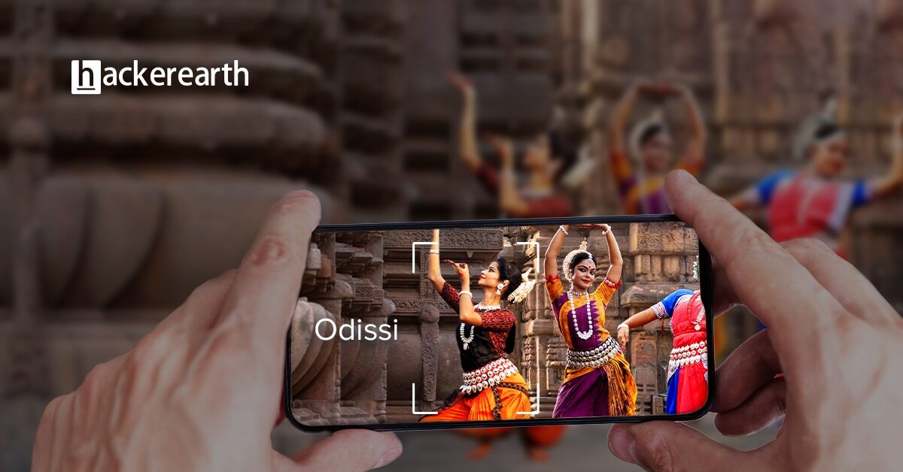

# Dance-Recognition-Hackerearth

# Dance-Recognition-Hackerearth




# Problem statement
This International Dance Day, an event management company organized an evening of Indian classical dance performances to celebrate the rich, eloquent, and elegant art of dance. 
After the event, the company plans to create a microsite to promote and raise awareness among people about these dance forms. However, identifying them from images is a difficult task.

The Task is to build a deep learning model that can help the company classify these images into eight categories of Indian classical dance.

The eight categories of Indian classical dance are as follows:

```
* Manipuri
* Bharatanatyam
* Odissi
* Kathakali
* Kathak
* Sattriya
* Kuchipudi
* Mohiniyattam
```

# Dataset Description

This data set consists of the following two columns:

<strong>Column Name	Description</strong>

* Image	Name of Image
* Target	Category of Image is any one of the dance forms as  ['manipuri','bharatanatyam','odissi','kathakali','kathak','sattriya','kuchipudi','mohiniyattam']


The data folder consists of two folders and two .csv files. The details are as follows:

* train: Contains 364 images for 8 classes ['manipuri','bharatanatyam','odissi','kathakali','kathak','sattriya','kuchipudi','mohiniyattam']
* test: Contains 156 images
* train.csv: 364 x 2
* test.csv: 156 x 1

# Competition Link

The competition can be found at the [link](https://www.hackerearth.com/practice/machine-learning/machine-learning-algorithms/understanding-deep-learning-parameter-tuning-with-mxnet-h2o-package-in-r/practice-problems/machine-learning/identify-the-dance-form-deea77f8/)


